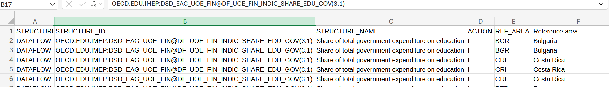

# Government Spending on Education: Cross-Country and Time Trend Analysis

## Background

Education is a key driver of economic growth and social equality. One important indicator is how much governments allocate to education.

The goal of this project is to analyze how education spending differs across education levels and countries over time.

The dataset used is from OECD (2025): "table displays the total government expenditure on education as a share of the total government expenditure on all services by level of education".

## Research Questions

The core research questions of this project are:

Which countries spent the largest share of government expenditure on all education (primary to tertiary) between 2015–2022?

Which countries spent the largest share of government expenditure on tertiary education between 2015–2022?

How has education spending changed over time across countries?

## Tools I Used

MS Excel

VS Code (for documentation)

ChatGPT (for formatting and cleaning the README file)

## Data Cleaning

Raw data looked like this:

### Remove columns

The first step in the data cleaning process was to remove unnecessary columns to simplify the dataset. Some columns contained only codes or null values and were not needed.

The following columns were kept and renamed (old name in parentheses):

country (reference area)

education level

financing source

time period

spending share (observation value)

observation status

This ensured that only relevant variables were used in the analysis.

### Handling individual values

Filters were applied to column headers to identify unwanted or missing values.

Rows with missing values in the Observation status column were removed.

Encoding issues (e.g., "Türkiye") were corrected to "Turkey" using find-and-replace.

Some observations appeared incorrectly scaled (e.g., India in 2015). These were identified using conditional formatting and removed to avoid distorting the analysis.

The Time period and Spending share columns were formatted as numeric values.

Result

screenshot here

## Analysis

The analysis was conducted using pivot tables in Excel, with countries as rows and average spending shares calculated across the selected time period.

screenshot here of the pivot table

### Which countries spent the largest share of government expenditure on all education between 2015–2022?

On average, the top 5 countries by spending on all education levels (primary to tertiary) between 2015–2022 were:

Indonesia — 17.39%

Costa Rica — 17.02%

South Africa — 16.14%

Chile — 15.59%

Peru — 14.04%

screenshot here

### Which countries spent the largest share of government expenditure on tertiary education between 2015–2022?

The top 5 spenders on tertiary education between 2015–2022 were:

Chile — 4.84%

Denmark — 4.77%

India — 4.69%

Costa Rica — 4.30%

Turkey — 4.28%

screenshot here

### How has education spending changed over time in all countries?

It is noticeable that since 2015, the overall trend in education spending has been slightly downward.

screenshot here

### Dashboard view

screenshot here

## Insights and summary

An interesting observation is that several emerging economies (such as Indonesia and Costa Rica) rank among the highest in education spending as a share of total government expenditure.

The decline in education spending after 2019 may be related to the COVID-19 pandemic, during which many governments shifted spending priorities. The fact that spending has not fully returned to pre-pandemic levels suggests that further analysis is needed to understand long-term trends.

## Sources

OECD (2025), Share of total government expenditure on education, OECD Data Explorer. https://data-explorer.oecd.org/vis?fs[0]=Topic%2C0%7CEducation%20and%20skills%23EDU%23&fs[1]=Topic%2C1%7CEducation%20and%20skills%23EDU%23%7CEducation%20resources%23EDU_RES%23&pg=0&fc=Topic&snb=6&df[ds]=dsDisseminateFinalDMZ&df[id]=DSD_EAG_UOE_FIN%40DF_UOE_FIN_INDIC_SHARE_EDU_GOV&df[ag]=OECD.EDU.IMEP&df[vs]=3.1&dq=..ISCED11_1T8%2BISCED11_1T4%2BISCED11_5T8.S13..._Z..&pd=2015%2C2023&to[TIME_PERIOD]=true
(accessed on 13 March 2026).
